# ER Diagram — Validation Center (P0 + P1)

> Render with any Mermaid-compatible viewer (GitHub, VS Code Mermaid plugin, Obsidian).
> Reserved columns for P2/P3/P4 are noted in `db/schema.sql` but omitted here for clarity.

```mermaid
erDiagram
    tenants ||--o{ users : has
    tenants ||--o{ templates : owns
    tenants ||--o{ datasets : owns
    tenants ||--o{ mappings : owns
    tenants ||--o{ recon_runs : owns
    tenants ||--o{ code_lists : owns

    users ||--o{ user_roles : assigned
    roles ||--o{ user_roles : grants

    templates ||--o{ template_versions : "has versions"
    template_versions ||--o{ template_fields : defines
    template_versions ||--o{ rules : defines
    rules ||--o{ rule_target_fields : targets
    template_fields ||--o{ rule_target_fields : "targeted by"
    code_lists ||--o{ code_list_items : contains
    template_fields }o--o| code_lists : "enum_ref"

    datasets ||--o{ dataset_columns : profiles

    template_versions ||--o{ mappings : "mapped for"
    mappings ||--o{ mapping_nodes : contains
    mappings ||--o{ mapping_edges : contains
    mapping_nodes ||--o{ mapping_edges : "from/to"
    mapping_nodes }o--o| template_fields : "ref (PDF)"
    mapping_nodes }o--o| dataset_columns : "ref (src/dst)"
    mapping_edges }o--o| rules : "bound rule"
    mappings }o--o| datasets : "source/dest"

    template_versions ||--o{ recon_runs : "spec used"
    mappings ||--o{ recon_runs : "mapping used"
    datasets ||--o{ recon_runs : "src/dst data"
    recon_runs ||--|| recon_summary : summarizes
    recon_runs ||--o{ recon_results : produces
    rules ||--o{ recon_results : "verdict by"

    tenants ||--o{ audit_log : records
    users ||--o{ audit_log : "actor"
```

## Entity Cheat-Sheet

| Entity | Role in system | Lifecycle / Immutability |
|---|---|---|
| `tenants` / `users` / `roles` | Identity & multi-tenancy | mutable |
| `audit_log` | Append-only trail (who/what/when, before/after) | **insert-only** |
| `templates` / `template_versions` | Business spec, versioned | version **immutable once PUBLISHED** |
| `template_fields` / `rules` / `rule_target_fields` | Field & comparison-rule definitions | frozen with the version |
| `code_lists` / `code_list_items` | Lookup tables (e.g. NCB codes) | versioned |
| `datasets` / `dataset_columns` | Source/Dest metadata (rows live in columnar engine) | mutable until run |
| `mappings` / `mapping_nodes` / `mapping_edges` | PDF→Source→Dest graph | edges carry approval state |
| `recon_runs` | One reconciliation execution | stamps template/mapping/engine version |
| `recon_summary` / `recon_results` | Explainable output | immutable; partition per run |

## Key Relationships (why they matter)

- **`recon_runs` stamps three versions** (`template_version_id`, `mapping_id`, `rule_engine_version`)
  → every report is reproducible and auditable.
- **`mapping_edges.rule_id`** binds a comparison to the exact rule that judged it
  → `recon_results.rule_id` traces each verdict back to its rule, and the rule back to its PDF citation (P3).
- **`mapping_nodes`** references *either* a `template_field` (PDF/spec side) *or* a
  `dataset_column` (source/dest side) — enforced by a CHECK constraint.
